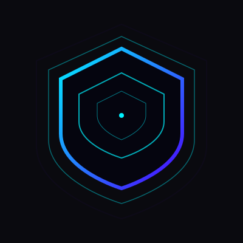

<p align="center">
  
</p>

<h1 align="center">NetZone</h1>

<p align="center">
  A non-root Android firewall application designed to provide granular control over per-application network access.
</p>

<p align="center">
  
  
  
  
</p>

<hr />

NetZone is a non-root Android firewall application designed to provide granular control over per-application network access. By implementing a local VPN sinkhole using the Android VpnService API, the application enables users to restrict network traffic for specific applications based on connection type, time-based schedules, or cumulative daily usage thresholds.

## Features

- **Granular Access Control**: Selectively enable or disable internet access for specific applications across WiFi, Mobile Data, and Roaming connections.
- **Advanced Scheduling**: Configure automated blocking rules with precise start and end times, including support for recurring day-of-week masks.
- **Usage Quotas**: Define daily time limits for applications; once the threshold is reached, network access is automatically restricted via integration with the Android Usage Statistics API.
- **Local-Only Processing**: All traffic filtering is performed locally on the device. Blocked packets are discarded within a virtual interface, ensuring data privacy and eliminating the need for external filtering servers.
- **Resource Optimized**: Features an efficient VPN lifecycle and scheduling architecture to minimize battery consumption and system overhead.
- **Modern Architecture**: Developed using Jetpack Compose to ensure a responsive, maintainable, and standards-compliant user interface.

## Technical Stack

- **Primary Language**: Kotlin
- **UI Framework**: Jetpack Compose
- **Persistence Layer**: Room Database (Rule management)
- **Configuration Storage**: Jetpack DataStore
- **Core Android APIs**:
  - `VpnService`: Facilitates local packet interception and filtering.
  - `UsageStatsManager`: Monitors application foreground duration for quota enforcement.
- **Concurrency**: Kotlin Coroutines and Flow for reactive data streams.

## Installation and Configuration

1. Obtain the application binary (APK) from the official repository releases or build from source.
2. Install the APK on a compatible Android device.
3. Grant the following system permissions as required:
   - **VPN Connectivity**: Essential for establishing the local traffic filtering tunnel.
   - **Usage Access**: Required for monitoring application usage and enforcing daily quotas.
   - **Notifications**: Optional, used to maintain foreground service persistence and provide status updates.

## Build Instructions

### Prerequisites
- **JDK 17**
- **Android SDK 34**
- **Gradle** (executable via the included wrapper)

### Debug Build
To generate a debug-signed APK, execute the following command:
```bash
./build.sh
```
The resulting artifact will be located at `app/build/outputs/apk/debug/app-debug.apk`.

### Release Build
To generate a release-ready APK, ensure that your signing configurations are correctly established and run:
```bash
./build-release.sh
```

## System Architecture

NetZone functions by initializing a local VPN interface that serves as a controlled gateway for device traffic. When an application is subjected to a blocking rule, the service dynamically reconfigures the routing table to direct that application's packets into the virtual tunnel. Rather than forwarding this traffic to a remote gateway, the service silently discards the packets (the "drain" process), effectively neutralizing the application's network capabilities without disrupting the connectivity of other system components.

## License

This project is distributed under the terms of the MIT License. For further details, please refer to the [LICENSE](LICENSE) file included in the repository.

---
Copyright © 2026 Yossef Sabry
